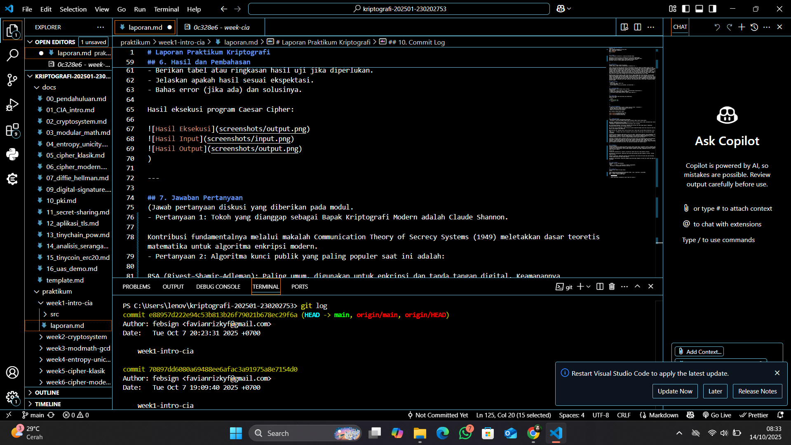
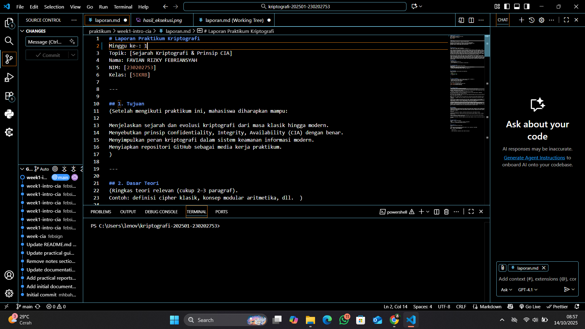
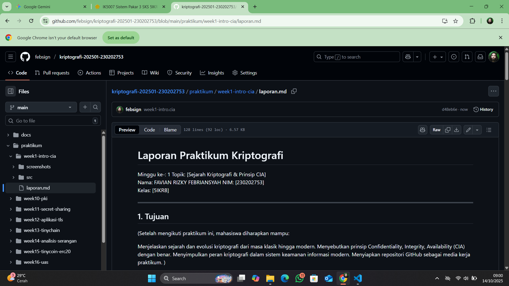

# Laporan Praktikum Kriptografi
Minggu ke-: 1 
Topik: [Sejarah Kriptografi & Prinsip CIA]  
Nama: FAVIAN RIZKY FEBRIANSYAH
NIM: [230202753]  
Kelas: [5IKRB]  

---

## 1. Tujuan
(Setelah mengikuti praktikum ini, mahasiswa diharapkan mampu:

Menjelaskan sejarah dan evolusi kriptografi dari masa klasik hingga modern.
Menyebutkan prinsip Confidentiality, Integrity, Availability (CIA) dengan benar.
Menyimpulkan peran kriptografi dalam sistem keamanan informasi modern.
Menyiapkan repositori GitHub sebagai media kerja praktikum.
)

---

## 2. Dasar Teori
(Ringkas teori relevan (cukup 2–3 paragraf).  
Contoh: definisi cipher klasik, konsep modular aritmetika, dll.  )

Ringkasan Sejarah dan Evolusi Kriptografi
Kriptografi terbagi dalam tiga era utama:

Era Klasik:

Basis: Karakter (huruf).

Metode: Substitusi (misalnya, Caesar Cipher) dan Transposisi (misalnya, Vigenère Cipher).

Kelemahan: Mudah dipecahkan dengan analisis frekuensi.

Era Modern:

Basis: Bit (0 dan 1) dan Matematika kompleks.

Algoritma: Dibagi menjadi:

Simetris: Satu kunci (shared secret), misalnya AES (cepat, untuk enkripsi data).

Asimetris/Publik: Dua kunci (publik dan privat), misalnya RSA (untuk tanda tangan dan pertukaran kunci).

Tujuan: Mencapai keamanan komputasi tinggi.

Era Kontemporer:

Fokus: Menciptakan sistem kepercayaan terdesentralisasi dan privasi.

Evolusi: Penggunaan kriptografi untuk:

Blockchain/Cryptocurrency: (Menggunakan hashing dan tanda tangan digital untuk imutabilitas).

ECC: (Versi asimetris yang lebih efisien).

PQC & ZKP: (Antisipasi kuantum dan peningkatan privasi).

Tiga pilar keamanan informasi (Prinsip CIA):

Confidentiality (Kerahasiaan):

Tujuan: Mencegah akses oleh pihak tidak berwenang.

Kunci: Enkripsi dan Kontrol Akses.

Integrity (Integritas):

Tujuan: Menjaga keutuhan dan keakuratan data dari modifikasi tidak sah.

Kunci: Hashing dan Tanda Tangan Digital.

Availability (Ketersediaan):

Tujuan: Memastikan pengguna yang berhak dapat mengakses sistem dan data kapan pun diperlukan.

Kunci: Redundancy dan perlindungan terhadap serangan (misalnya DDoS).

## 3. Alat dan Bahan
(- Python 3.x  
- Visual Studio Code / editor lain  
- Git dan akun GitHub  
- Library tambahan (misalnya pycryptodome, jika diperlukan)  )

---

## 4. Langkah Percobaan
(Tuliskan langkah yang dilakukan sesuai instruksi.  
Contoh format:
1. Membuat file `caesar_cipher.py` di folder `praktikum/week2-cryptosystem/src/`.
2. Menyalin kode program dari panduan praktikum.
3. Menjalankan program dengan perintah `python caesar_cipher.py`.)

---

## 5. Source Code
(Salin kode program utama yang dibuat atau dimodifikasi.  
Gunakan blok kode:

```python
# contoh potongan kode
def encrypt(text, key):
    return ...
```
)

---

## 6. Hasil dan Pembahasan
(- Lampirkan screenshot hasil eksekusi program (taruh di folder `screenshots/`).  
- Berikan tabel atau ringkasan hasil uji jika diperlukan.  
- Jelaskan apakah hasil sesuai ekspektasi.  
- Bahas error (jika ada) dan solusinya. 

Hasil eksekusi program Caesar Cipher:




)

---

## 7. Jawaban Pertanyaan
(Jawab pertanyaan diskusi yang diberikan pada modul.  
- Pertanyaan 1: Tokoh yang dianggap sebagai Bapak Kriptografi Modern adalah Claude Shannon.

Kontribusi fundamentalnya melalui makalah Communication Theory of Secrecy Systems (1949) meletakkan dasar teoretis matematika untuk algoritma enkripsi modern.
- Pertanyaan 2: Algoritma kunci publik yang paling populer saat ini adalah:

RSA (Rivest–Shamir–Adleman): Paling umum, digunakan untuk enkripsi dan tanda tangan digital. Keamanannya berdasarkan kesulitan faktorisasi bilangan prima besar.

ECC (Elliptic Curve Cryptography): Lebih efisien dan cepat daripada RSA dengan ukuran kunci yang jauh lebih kecil. Populer untuk keamanan web (HTTPS/TLS).

Diffie-Hellman (DH): Digunakan khusus untuk pertukaran kunci rahasia agar dua pihak dapat berkomunikasi secara aman.
- Pertanyaan 3:  Perbedaan utama antara kriptografi klasik dan modern terletak pada cara kerjanya dan tingkat keamanannya.

Kriptografi Klasik beroperasi pada karakter (huruf atau simbol). Algoritmanya sederhana, hanya menggunakan teknik seperti substitusi (mengganti satu huruf dengan yang lain) dan transposisi (mengubah urutan huruf). Karena kesederhanaannya, sistem ini rentan dan mudah dipecahkan, sering kali hanya dengan menggunakan analisis frekuensi (menghitung kemunculan huruf). Sistem ini umumnya dilakukan secara manual atau mekanis.

Sebaliknya, kriptografi Modern beroperasi pada bit (nilai biner 0 dan 1) dan didasarkan pada prinsip matematika yang kompleks, memanfaatkan aljabar dan teori bilangan. Kekuatan keamanannya sangat tinggi (aman secara komputasi), karena untuk memecahkannya dibutuhkan daya komputasi yang tidak praktis (memakan waktu ribuan tahun). Kriptografi modern menggunakan dua jenis kunci: kunci simetris (satu kunci rahasia) dan kunci asimetris atau kunci publik (pasangan kunci publik dan privat), dan dijalankan sepenuhnya oleh komputer digital.
)
---

## 8. Kesimpulan
Sejarah Kriptografi
Kriptografi bermula dari metode kuno berbasis karakter seperti Sandi Caesar (kriptografi klasik). Perubahan besar terjadi dengan diperkenalkannya komputer, yang melahirkan kriptografi modern berbasis bit dan matematika kompleks (dipelopori oleh Claude Shannon) untuk mencapai keamanan komputasi yang tinggi, menggunakan baik kunci simetris maupun asimetris (publik).

Prinsip CIA
Prinsip CIA (Confidentiality, Integrity, Availability) adalah tiga pilar utama keamanan informasi:

Confidentiality (Kerahasiaan): Memastikan hanya pihak yang berwenang yang dapat mengakses informasi. (Dicapai dengan Enkripsi).

Integrity (Integritas): Memastikan informasi belum dimodifikasi atau dirusak oleh pihak yang tidak berwenang. (Dicapai dengan Hasing dan Tanda Tangan Digital).

Availability (Ketersediaan): Memastikan pengguna yang berhak dapat mengakses informasi dan sumber daya kapan pun dibutuhkan.

---

## 9. Daftar Pustaka
(Cantumkan referensi yang digunakan.  
Contoh:  
- Katz, J., & Lindell, Y. *Introduction to Modern Cryptography*.  
- Stallings, W. *Cryptography and Network Security*.  )

---

## 10. Commit Log
(Tuliskan bukti commit Git yang relevan.  
Contoh:
```
commit e88957d222e94c53b813b26f79021b678ec29f6a (HEAD -> main, origin/main, origin/HEAD)
Author: febsign <favianrizkyf@gmail.com>
Date:   Tue Oct 7 20:23:31 2025 +0700

    week1-intro-cia

    week2-cryptosystem: implementasi Caesar Cipher dan laporan )
```
