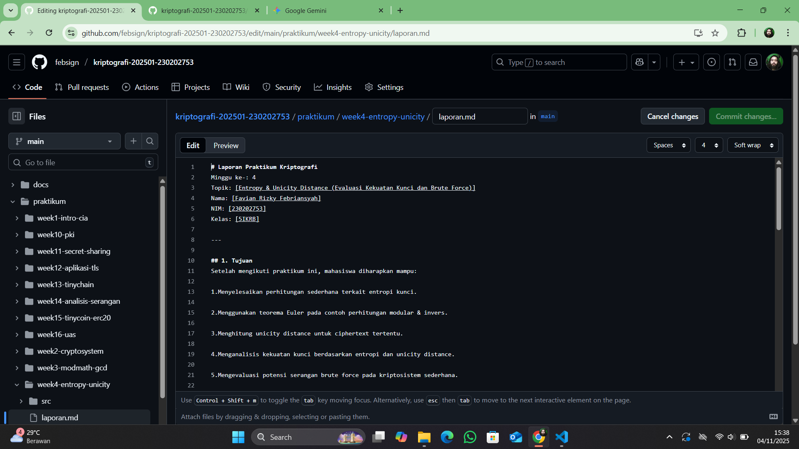

# Laporan Praktikum Kriptografi
Minggu ke-: 4  
Topik: [Entropy & Unicity Distance (Evaluasi Kekuatan Kunci dan Brute Force)]  
Nama: [Favian Rizky Febriansyah]  
NIM: [230202753]  
Kelas: [5IKRB]  

---

## 1. Tujuan
Setelah mengikuti praktikum ini, mahasiswa diharapkan mampu:

1.Menyelesaikan perhitungan sederhana terkait entropi kunci.

2.Menggunakan teorema Euler pada contoh perhitungan modular & invers.

3.Menghitung unicity distance untuk ciphertext tertentu.

4.Menganalisis kekuatan kunci berdasarkan entropi dan unicity distance.

5.Mengevaluasi potensi serangan brute force pada kriptosistem sederhana.


---

## 2. Dasar Teori
. Entropi (Entropy, $H(K)$)Definisi: Entropi dalam kriptografi adalah ukuran tingkat keacakan dan ketidakpastian suatu kunci ($K$) . Diukur dalam bit.Fungsi: Menentukan kekuatan kunci secara matematis. Semakin tinggi nilai entropi (misalnya 128 bit), semakin banyak kombinasi kunci unik yang harus dicoba penyerang ($2^{H(K)}$), sehingga kunci menjadi lebih kuat.2. Unicity Distance ($U$)Definisi: Panjang minimum ciphertext (pesan terenkripsi) yang diperlukan agar kunci enkripsi yang benar menjadi unik secara statistik .Fungsi: Mengukur batas teoritis di mana redundansi bahasa (plaintext yang dapat ditebak) dalam ciphertext mulai "mengalahkan" entropi kunci. Di bawah $U$, mungkin ada banyak kunci yang menghasilkan plaintext yang terlihat masuk akal; di atas $U$, hanya satu kunci yang benar.$$\text{Dirumuskan sebagai: } U = \frac{\text{Entropi Kunci}}{\text{Redundansi Bahasa}}$$3. Brute Force (Serangan)Definisi: Metode serangan dengan mencoba semua kemungkinan kunci satu per satu hingga kunci yang benar ditemukan dan pesan dapat didekripsi .Hubungan: Efektivitas serangan brute force berbanding lurus dengan daya komputasi penyerang dan berbanding terbalik dengan entropi kunci. Kunci dengan entropi tinggi membuat brute force menjadi tidak layak secara waktu dan biaya.

---

## 3. Alat dan Bahan
(- Python 3.x  
- Visual Studio Code / editor lain  
- Git dan akun GitHub  
- Library tambahan (misalnya pycryptodome, jika diperlukan)  )

---

## 4. Langkah Percobaan
(Tuliskan langkah yang dilakukan sesuai instruksi.  
Contoh format:
1. Membuat file `caesar_cipher.py` di folder `praktikum/week2-cryptosystem/src/`.
2. Menyalin kode program dari panduan praktikum.
3. Menjalankan program dengan perintah `python caesar_cipher.py`.)

---

## 5. Source Code
(Salin kode program utama yang dibuat atau dimodifikasi.  
Gunakan blok kode:

```python
# contoh potongan kode
def encrypt(text, key):
    return ...
```
)

---

## 6. Hasil dan Pembahasan
(- Lampirkan screenshot hasil eksekusi program (taruh di folder `screenshots/`).  
- Berikan tabel atau ringkasan hasil uji jika diperlukan.  
- Jelaskan apakah hasil sesuai ekspektasi.  
- Bahas error (jika ada) dan solusinya. 

Hasil eksekusi program Caesar Cipher:




)

---

## 7. Jawaban Pertanyaan
(Jawab pertanyaan diskusi yang diberikan pada modul.  
- Pertanyaan 1: 🔑 Pengaruh Entropy pada Kekuatan Kunci
Entropi Tinggi:
Menunjukkan kunci tersebut sangat acak dan tidak dapat diprediksi.
Artinya, ada jumlah kemungkinan kombinasi yang sangat besar yang harus dicoba oleh penyerang (misalnya, menggunakan serangan brute force).
Ini membuat kunci lebih kuat dan lebih sulit untuk dipecahkan.
Entropi Rendah:
Menunjukkan kunci tersebut kurang acak atau memiliki pola yang mudah ditebak.
Artinya, jumlah kemungkinan kombinasi yang harus dicoba lebih sedikit.
Ini membuat kunci lebih lemah dan rentan terhadap serangan.
Singkatnya, semakin tinggi nilai entropy (diukur dalam bit), semakin kuat dan aman kunci tersebut.  

- Pertanyaan 2: Unicity Distance ($U$) adalah panjang minimum ciphertext (pesan terenkripsi) yang diperlukan agar kunci enkripsi yang benar menjadi satu-satunya kunci yang secara statistik menghasilkan plaintext yang dapat dimengerti.Mengapa Ini Penting?Batas Kriptanalisis Teoritis: $U$ menunjukkan kapan redundansi bahasa (plaintext yang mudah ditebak) mulai mengalahkan keacakan kunci (entropy).Menentukan Kerentanan: Jika penyerang mendapatkan ciphertext dengan panjang lebih dari $U$, secara teori, mereka memiliki cukup data untuk menemukan kunci yang benar hanya melalui analisis statistik (karena semua kunci palsu akan menghasilkan omong kosong/teks acak).Intinya: $U$ memberi tahu perancang cipher batas aman seberapa banyak data yang boleh dienkripsi dengan kunci yang sama sebelum kunci tersebut berisiko terungkap secara unik melalui analisis statistik ciphertext.

- Pertanyaan 3: 1. 🔑 Fokus Serangan Ada pada Kunci, Bukan Algoritma
Kelemahan Implementasi: Algoritma yang kuat (seperti AES) dirancang untuk tidak dapat dipecahkan dalam waktu yang wajar. Namun, kunci yang lemah (misalnya, password pendek atau mudah ditebak) akan mengurangi jumlah total kombinasi yang harus dicoba secara drastis.

Keacakan Rendah (Low Entropy): Brute force mengeksploitasi entropi kunci yang rendah. Jika kuncinya pendek atau tidak acak, bahkan algoritma terkuat pun tidak bisa melindunginya sepenuhnya.

2. ⚡ Peningkatan Daya Komputasi
GPU dan Komputasi Paralel: Serangan brute force modern memanfaatkan GPU (kartu grafis) dan komputasi paralel yang sangat cepat, memungkinkan jutaan hingga miliaran tebakan per detik.

Komputasi Kuantum (Ancaman Masa Depan): Perkembangan komputasi kuantum berpotensi mengurangi waktu brute force pada beberapa algoritma secara eksponensial, menjadikannya ancaman nyata di masa depan.
)
---

## 8. Kesimpulan
📝 Kesimpulan Percobaan Kekuatan Kunci (Entropy & Unicity Distance)Eksperimen ini menunjukkan bahwa keamanan kunci kriptografi tidak hanya bergantung pada algoritma (cipher) tetapi terutama pada kualitas kuncinya.Entropi adalah Kekuatan Kunci:Kunci yang Kuat harus memiliki Entropi Tinggi  (panjang, acak, dan variasi karakter banyak), karena ini meningkatkan jumlah total kombinasi yang harus dicoba oleh brute force.Unicity Distance Menentukan Batas Data:Jika panjang ciphertext yang diamati melebihi Unicity Distance ($U$) , kunci enkripsi secara teoritis dapat diungkap melalui analisis statistik ciphertext dan redundansi bahasa (plaintext), bahkan tanpa mencoba semua kemungkinan kunci.Brute Force Selalu Menjadi Ancaman:Meskipun algoritma kuat, brute force tetap efektif jika:a. Kunci yang digunakan lemah (entropi rendah).b. Penyerang memiliki daya komputasi tinggi yang mampu menguji miliaran kombinasi kunci per detik.

---

## 9. Daftar Pustaka
(Cantumkan referensi yang digunakan.  
Contoh:  
- Katz, J., & Lindell, Y. *Introduction to Modern Cryptography*.  
- Stallings, W. *Cryptography and Network Security*.  )

---

## 10. Commit Log

commit abc12345
Author: Favian Rizky Febriansyah <favianrizkyf@gmail.com>
Date:   2025-11-04

    week4-entropy-unicity: Entropy & Unicity Distance (Evaluasi Kekuatan Kunci dan Brute Force)
```
