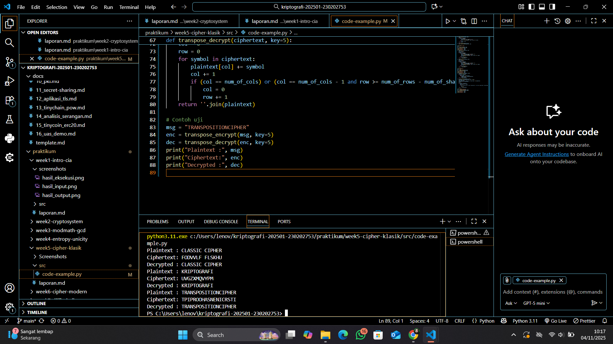
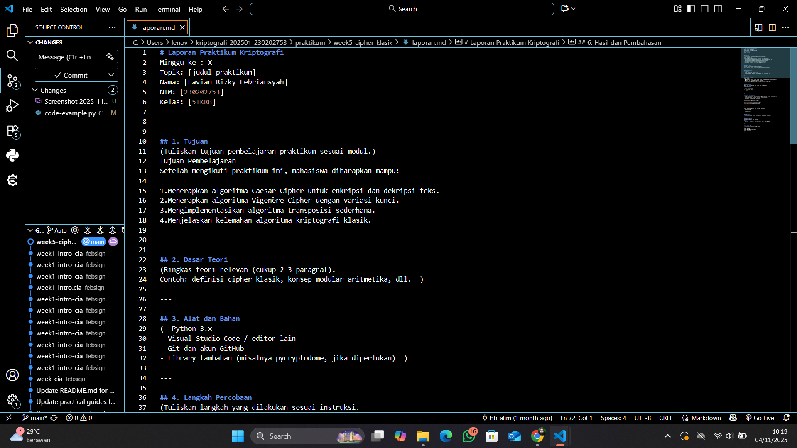

# Laporan Praktikum Kriptografi
Minggu ke-: 5  
Topik: [Cipher Klasik (Caesar, Vigenère, Transposisi)]  
Nama: [Favian Rizky Febriansyah]  
NIM: [230202753]  
Kelas: [5IKRB]  

---

## 1. Tujuan
(Tuliskan tujuan pembelajaran praktikum sesuai modul.)
Tujuan Pembelajaran
Setelah mengikuti praktikum ini, mahasiswa diharapkan mampu:

1.Menerapkan algoritma Caesar Cipher untuk enkripsi dan dekripsi teks.
2.Menerapkan algoritma Vigenère Cipher dengan variasi kunci.
3.Mengimplementasikan algoritma transposisi sederhana.
4.Menjelaskan kelemahan algoritma kriptografi klasik.

---

## 2. Dasar Teori
📜 Teori Cipher KlasikCipher Klasik adalah metode enkripsi awal yang bekerja pada karakter.1. Jenis UtamaJenisMekanismeKelemahan KunciContohSubstitusiMengganti huruf (A jadi D).Analisis Frekuensi (pola huruf terbanyak terlihat).Caesar, Vigenère.TransposisiMengubah Posisi/Urutan huruf.Frekuensi huruf tetap sama dengan aslinya.Rail Fence, Kolom.2. Kelemahan Umum Semua cipher klasik rentan karena gagal mengaburkan pola statistik alami bahasa manusia.
---

## 3. Alat dan Bahan
(- Python 3.x  
- Visual Studio Code / editor lain  
- Git dan akun GitHub  
- Library tambahan (misalnya pycryptodome, jika diperlukan)  )

---

## 4. Langkah Percobaan
(Tuliskan langkah yang dilakukan sesuai instruksi.  
Contoh format:
1. Membuat file `caesar_cipher.py` di folder `praktikum/week2-cryptosystem/src/`.
2. Menyalin kode program dari panduan praktikum.
3. Menjalankan program dengan perintah `python caesar_cipher.py`.)

---

## 5. Source Code
(Salin kode program utama yang dibuat atau dimodifikasi.  
Gunakan blok kode:

```python
# contoh potongan kode
def encrypt(text, key):
    return ...
```
)

---

## 6. Hasil dan Pembahasan
(- Lampirkan screenshot hasil eksekusi program (taruh di folder `screenshots/`).  
- Berikan tabel atau ringkasan hasil uji jika diperlukan.  
- Jelaskan apakah hasil sesuai ekspektasi.  
- Bahas error (jika ada) dan solusinya. 

Hasil eksekusi program Caesar Cipher:




)

---
## 7. Jawaban Pertanyaan
(Jawab pertanyaan diskusi yang diberikan pada modul.  
- Pertanyaan 1: 🔑 Caesar Cipher
Kelemahan Utama: Jumlah kunci sangat terbatas (hanya 25 kemungkinan) dan mudah dipecahkan dengan serangan brute-force atau analisis frekuensi karena pergeseran huruf selalu tetap (monoalfabetik).

🔐 Vigenère Cipher
Kelemahan Utama: Kunci berulang jika panjang kunci lebih pendek dari pesan. Pengulangan ini menciptakan pola yang dapat dieksploitasi menggunakan Uji Kasiski atau analisis frekuensi yang dimodifikasi untuk menemukan panjang kunci, setelah itu sandi menjadi serangkaian sandi Caesar. 

- Pertanyaan 2: Cipher klasik, terutama yang bersifat monoalfabetik (seperti Caesar Cipher), mudah diserang karena mereka:

Mempertahankan Pola Bahasa: Sandi-sandi ini gagal mengubah atau menyamarkan frekuensi kemunculan huruf-huruf pada teks asli (plaintext).

Korelasi Langsung: Huruf yang paling sering muncul di plaintext (misalnya, huruf 'E' dalam bahasa Inggris) akan selalu menjadi huruf yang paling sering muncul di ciphertext.

Dengan membandingkan frekuensi huruf pada teks tersandi (ciphertext) dengan tabel frekuensi standar suatu bahasa , kriptanalis dapat dengan mudah mengidentifikasi penggantian yang terjadi dan memecahkan sandi tersebut.

- Pertanyaan 3: Kesimpulan Singkat
Substitusi Cipher: Baik dalam menyembunyikan identitas huruf, tetapi rentan pada pola frekuensi.

Transposisi Cipher: Baik dalam menyembunyikan posisi huruf, tetapi sangat rentan karena frekuensi huruf tidak berubah.
)
---

## 8. Kesimpulan
📝 Kesimpulan Percobaan Cipher Klasik
Percobaan dengan Cipher Klasik menunjukkan bahwa algoritma-algoritma ini, meskipun sederhana untuk diimplementasikan, memiliki tingkat keamanan yang sangat rendah di era modern.

Inti Permasalahan: Cipher Klasik gagal mencapai keamanan yang memadai karena mereka tidak efektif dalam mengaburkan pola statistik (frekuensi huruf) dari bahasa alami.

Hasil Kriptanalisis: Mereka mudah dipecahkan menggunakan teknik kriptanalisis yang relatif sederhana, seperti Analisis Frekuensi (untuk Substitusi Cipher) dan Uji Kasiski (untuk Cipher Polialfabetik seperti Vigenère).

Pentingnya Kombinasi: Untuk keamanan yang lebih baik, diperlukan penggabungan antara metode Substitusi (mengubah huruf) dan Transposisi (mengubah posisi) untuk menciptakan super enkripsi yang lebih sulit dipecahkan.

Kesimpulannya, cipher klasik kini hanya cocok untuk tujuan edukasi atau enkripsi data dengan kebutuhan keamanan yang sangat minimal.

---

## 9. Daftar Pustaka
(Cantumkan referensi yang digunakan.  
Contoh:  
- Katz, J., & Lindell, Y. *Introduction to Modern Cryptography*.  
- Stallings, W. *Cryptography and Network Security*.  )

---

## 10. Commit Log
```
commit 7362d2e600b1df5195a06c5e8055b33571c74822 (HEAD -> main, origin/main, origin/HEAD)
Author: febsign <favianrizkyf@gmail.com>
Date:   Tue Nov 4 10:52:10 2025 +0700

    week5-cipher-klasik
```
